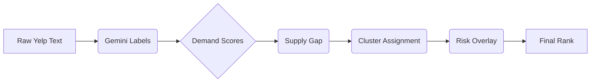

# System Design & Algorithmic Framework

**Project:** NYC Halal Market Intelligence  
**Team:** Amanda Dong (`yd2825`), Tony Zhao (`sz3822`), Harsh Agarwal (`ha2957`), Siqi Zhu (`sz3950`), Catherine Yi (`cgy2014`)

## Architectural Overview

The system is designed as a decoupled, 4-phase analytic pipeline where each stage performs a discrete transformation of the feature space, ultimately converging on a risk-adjusted, spatially-aware opportunity ranking.

```
CS473-FML/
├── src/                         # Core Algorithmic Engine
│   ├── halal_demand.py          # Bayesian demand extraction & shrinkage
│   ├── halal_opportunity.py     # Multi-cuisine supply-gap & diversification metrics
│   ├── halal_kmeans.py          # k-means++ unsupervised segmentation
│   ├── halal_similarity.py      # Cosine-based contextual retrieval
│   ├── halal_risk.py            # GMM-based probabilistic risk modeling
│   ├── halal_forecast.py        # RidgeCV temporal growth prediction
│   └── halal_spatial.py         # LISA spatial autocorrelation & Hot Spot detection
├── scripts/                     # Phase Runners & Orchestration
│   ├── run_phase1.py            # Market Characterization Pipeline
│   ├── run_phase2.py            # Contextual Retrieval & Scoring Pipeline
│   ├── run_phase3.py            # Risk-Adjusted Forecasting Pipeline
│   └── run_all.py               # Full-pipeline orchestrator with output validation
├── frontend/                    # Decision-Support Interface
│   ├── app.py                   # Streamlit UI with SHAP-style explainability
│   └── components/              # Interactive Plotly & MapBox modules
└── data/                        # Data Persistence Layer
    ├── raw/                     # Yelp (text), Gemini (labels), CAMIS (admin)
    ├── processed/               # Parquet-optimized hygiene & demographic features
    └── output/                  # Serialized analytic results
```

---

## Data Flow Diagram



---

## Methodological Deep-Dive

### 1. Phase 1 — Market Characterization & Clustering
- **Demand Estimation**: We utilize **Bayesian Shrinkage** to estimate the true share of halal-related demand.
- **Latent Demand Signal**: Derived from a hybrid keyword scan and implicit Gemini zero-shot labels, functioning as an activity proxy independent of current supply.
- **Cluster Confidence Score**: Computed via the centroid separation ratio to provide uncertainty quantification for NTA assignments.
- **Segmentation**: A custom **k-means++** implementation identifies market tiers (e.g., *Established Hubs* vs. *High-Opportunity Gaps*).

### 2. Phase 2 — Contextual Retrieval & Spatial Analysis
- **Cosine Profiling**: Benchmarks NTA similarity across feature vectors.
- **Spatial Autocorrelation**: We utilize `halal_spatial.py` for **Local Moran's I (LISA)** analysis to distinguish between "Hot Spots" and "Spatial Outliers" in market opportunity.

### 3. Phase 3 — Probabilistic Risk & Temporal Forecasting
- **Probabilistic Risk (GMM)**: Fits a **Gaussian Mixture Model** (optimized via BIC) to capture hygiene risk distributions.
- **Predictive Growth (RidgeCV)**: Cross-validated Ridge models forecast demand share and merchant entry rates.
- **Confidence-Adjusted Ranking**: The final `final_score_adjusted` integrates:
    - Base Opportunity Score
    - LISA spatial bonus (8% weight) for Hot Spot NTAs
    - Cluster confidence weight (downweights borderline NTAs)
    - Risk penalty (from GMM)

### 4. Planned: Phase 4 — Neural Demand Embeddings
We are architecting a transition toward deep latent representation:
- **Transformer Embeddings**: Processing Yelp review text through domain-tuned encoders to capture nuanced, multi-dimensional semantic "halal interest" profiles.
- **Federated NTA Similarity**: Learning shared latent spaces to identify inter-NTA demand commonalities that traditional clustering fails to isolate.

---

## Evaluation Metrics
- **Clustering Quality**: Silhouette Score for segment distinctness.
- **Forecasting Accuracy**: R2 score for RidgeCV temporal predictions.
- **Spatial Robustness**: Moran's I index for measuring spatial signal strength and hot-spot reliability.

---

## Division of Labor & Module Ownership

| Specialist | Primary Domain & Module Responsibility |
| :--- | :--- |
| **Amanda Dong** | **UX Architecture & Visualization**: Leads the design of the Streamlit interface (`frontend/app.py`), focusing on the translation of complex ML scores into intuitive Plotly radar charts and MapBox layers. |
| **Catherine Yi** | **Probabilistic Modeling & Forecasting**: Architect of the Phase 3 pipeline. Owns the GMM risk implementation (`src/halal_risk.py`) and the RidgeCV growth models (`src/halal_forecast.py`). |
| **Harsh Agarwal** | **Data Engineering & Hygiene Quality**: Steward of the administrative supply records and inspection aggregates. Owns `src/halal_opportunity.py` and ensure temporal alignment via `scripts/check_camis_time.py`. |
| **Siqi Zhu** | **NLP & Demand Signal Engineering**: Owns the Yelp ↔ Gemini ingestion logic (`src/halal_demand.py`). Responsible for the Bayesian shrinkage implementation and latent signal extraction. |
| **Tony Zhao** | **Unsupervised Learning & Ranking Systems**: Executes the k-means++ segmentation logic (`src/halal_kmeans.py`) and the Phase 2 similarity/ranking engine (`src/halal_similarity.py`). |
